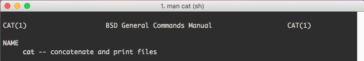
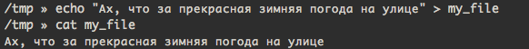
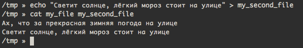
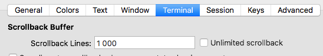
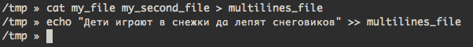
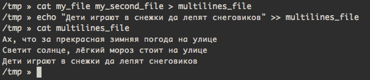
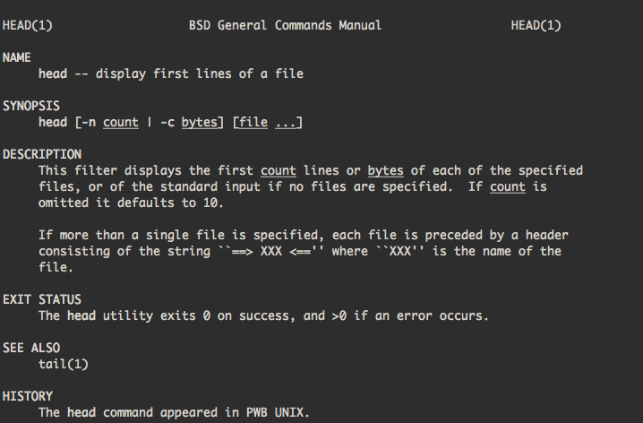

# Вторая часть
Содержание:

 1. Просмотр текстовых файлов
 2. Редактирование текстовых файлов
 3. Apt
 

### Просмотр текстовых файлов
Существует несколько утилит для просмотра текстовых файлов в консоли, такие как `cat`, `less`, и немного специфичные `head`, `tail`. Давай посмотрим на них подробнее:
#### :heavy_plus_sign: `cat`
Название этой утилиты не имеет ничего общего с котами и кошками и является сокращением от concatenate (конкатенация). При помощи этой утилиты можно конкатенировать файлы. Воу воу, что же такое **конкатенация**? Давайте обратимся к википедии:

> Конкатена́ция (лат. concatenatio «присоединение цепями; сцепле́ние») — операция склеивания объектов линейной структуры, обычно строк. Например, конкатенация слов «микро» и «мир» даст слово «микромир».

Строка - объект линейной структуры??? Ну, да, в терминах многих языков программирования строка представляет собой одномерный массив с символами. Массив (**Array** на английском), на всякий случай, представляет собой множество однотипных элементов, как, например, дома на улице. Каждый дом похож друг на друга и имеет порядковый номер:

`array = [дом1, дом2, дом3, ...]`

Строка (Обычно, **String** на английском) `привет!` будет содержать символы:

`string_hello = ['п', 'р', 'и', 'в', 'е', 'т', '!',]` 

Допустим, у нас есть ещё одна строка c текстом `Вася, `:

`string_vasya = ['В', 'а', 'с', 'я', ',', ' ', ]`

Давай проведём конкатенацию этих строк!

`string_vasya + string_hello`

Получится строка `Вася, привет!`

Что произошло при сложении строк? Общими словами была создана новая строка (массив с символами) размером в 13 символов, в которую в начале поместили символы первой строки, затем символы второй строки. Почему 13? Потому что это минимальное число символов, которое сможет уместить в себя обе строки (`привет!` - 7 символов,  `Вася, ` - 6 символов).

Запутанно, и как это связано с чтением файлов? Давайте глянем в `man cat`:

Утилита `cat` не только конкатенирует файлы, но и печатает их на консоль, чем собственно мы и воспользуемся. Если мы передадим всего один файл в эту утилиту, то она просто напечатает его на экране (и впрямь, конкатенировать его ведь не с чем):

Давай попробуем объединить два файла и вывести их на экран:

### :arrow_down_small: `head`
Эта утилита выводит несколько первых строк из файла. Просто и удобно. Зачем это нужно, скажешь ты? Допустим, у нас есть файл, причем файл довольно объемный, мегабайт так на 50. При помощи `cat` его не просмотришь, он просто не влезет в консоль (да да, вывод в консоль ограничивается некоторым числом строк, число выставляется в настройках эмулятора терминала) и будет показан только его конец.

> Настройка числа строк в iTerm 2. Есть опция неограниченного числа строк (unlimited srollback), но в нашем случае это не панацея

>

Давай попробуем `head` в деле. Для начала сделаем файл с несколькими строками:

Вначале объединим два наших файла и вывод утилиты `cat` направим в новый файл. Затем добавим новую строку при помощи команды `echo`.

Проверим содержимое файла:

Затем глянем в `man head`:

#### Мини-раздел "читаем документацию в `man`"

Очень важно научиться читать документацию. Да, она на английском языке, поэтому вооружаемся словариками. Пройдемся по разделам и попробуем понять, что же из себя представляет такая простая6 с виду, утилита `head`:

**NAME**

Приведено название команды и что она в принципе делает. Вольный перевод:

`head --отоборажает первые строки файла`

**SYNOPSIS**

Синопсис содержит в себе информацию о том, как можно использовать команду. Синопсис утилиты `head` выглядит следующим образом:

`head [-n count | -c bytes] [file ...]`

Как это понимать? Для начала взглянем на то, что он разделён на блоки:
- `head` - имя утилиты
- `[-n count | -c bytes]` - флаги с параметрами
- `[file ...]` - основные параметры утилиты
 
 Давайте попробуем разобраться что к чему. С первым блоком должно быть все понятно. 
 
 Второй блок заключен в квадратные скобки. Что это значит? Квадратные скобки означают то, **что находиться в них является необязательным**!. Мы можем вызвать команду без этого блока.
 С квадратными скобками мы разобрались и можем их опустить. Теперь можно представить второй блока как `-n count | -c bytes`. Как было уже сказанно выше, этот блок содержит флаги. Флаги обычно начинаются со знака - и позволяют передать утилите дополнительные параметры. Здесь есть два флага:
 
 - `-n count` - устанавливаем количество выводимых строк (как мы помним, `head` выводит несколько первых строк файла)
 - `-c bytes` - устанавливает количество выводимых байт (например, мы хотим вывести первые 1024 байта, иногда полезно)
 
 Как можно заметить, флаги разделяет символ вертикальной черты **|** . Данный символ принято читать как **ИЛИ** . Мы выводим несколько строк **ИЛИ** некоторое количество байт, но вместе эти параметры использовать нельзя.
 
 Взглянем на поледний блок `[file ..]`. Внутри него можно передать файл или несколько файлов, из которых будут выведены первые строки. По квадратным скобкам становится ясно, что он тоже не обязателен к написанию. Но как же так, если мы не напишем из какого файла выводить строки, что же будет??? Читаем документацию дальше
 
 **Description**
 Тут уже идет нормальная, человекочитаемая документация на английском языке. 
 
 `This filter displays are the first count lines or bytes for each of the specified files, or of the standart input if no files are specified` - Этот фильтр отображает заданное число первых строк или байт из каждого указанного файла или использует стандартный поток ввода если файлы не заданы.
 
 Как видно, `head` назвали **фильтром**. При помощи него можно фильтровать информацию в так называемых пайплайнах (`pipe-line`) или как их ещё называют конвеерах. Это отдельная глава, сейчас мы коснёмся её лишь вскользь.
 
